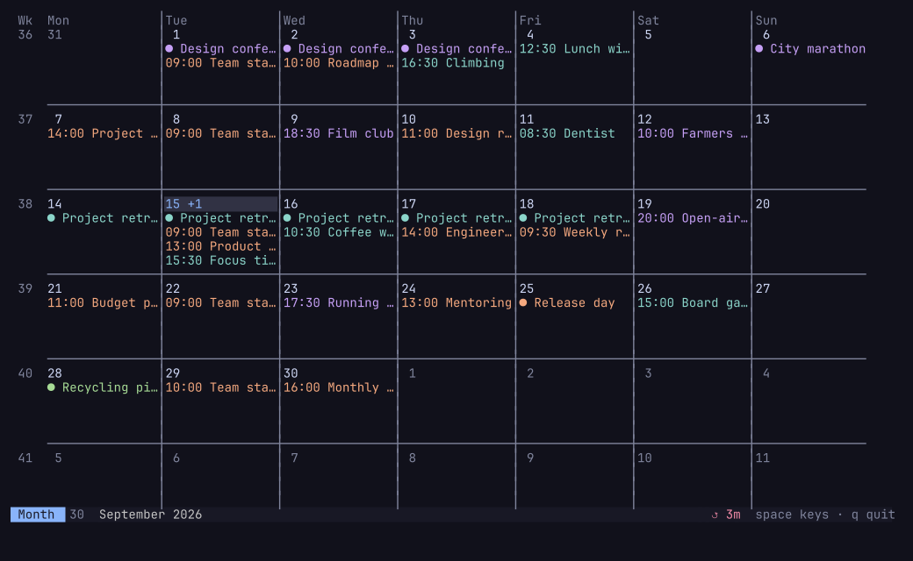
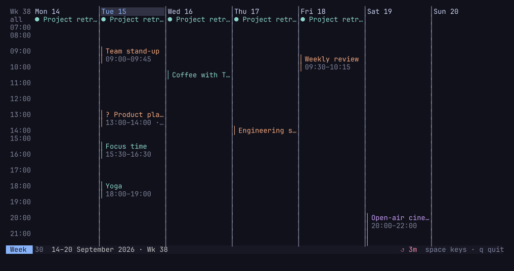
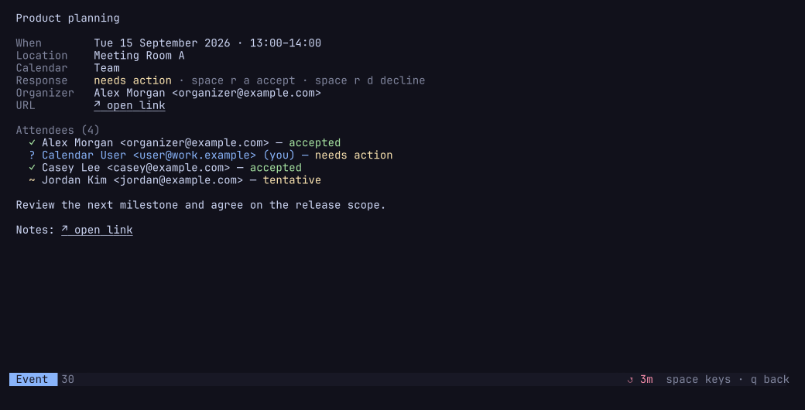

# calterm

A cache-first CalDAV and WebCal calendar for the terminal, with a Waybar module
and direct CalDAV invitation responses.

> [!NOTE]
> This project is 100% vibe-coded.

- **TUI** — agenda, month grid, week/day timeline, and event detail, built with Bubble Tea.
- **Waybar** — `calterm waybar` prints your next event as a JSON status line.
- **Offline** — everything reads a local cache. The status bar never touches the network.
- **Correct recurrences** — RRULE, RDATE, EXDATE, and RECURRENCE-ID overrides, including cancellations and DST transitions.

## Screenshots

The screenshots use a fully synthetic calendar; no real account or event data
is included.

### Month



### Week



### Invitation detail



## Install

```bash
go install github.com/tonobo/calterm/cmd/calterm@latest
```

## Configure

```bash
mkdir -p ~/.config/calterm
cp contrib/config.example.toml ~/.config/calterm/config.toml
$EDITOR ~/.config/calterm/config.toml
```

Point `url` at your server's DAV root — calterm discovers your calendars from
there. The password is read from the first line of `password_cmd`'s output, so
it never has to sit on disk:

```toml
[[account]]
name = "personal"
url = "https://cloud.example.com/remote.php/dav"
username = "calendar-user"
password_cmd = "pass show caldav/nextcloud"
# Optional: identify your ATTENDEE entry for direct invitation responses.
email = "calendar-user@example.com"
```

Read-only iCalendar subscriptions need only a stable local name and their URL.
Both `https://` and `webcal://` links are accepted:

```toml
[[webcal]]
name = "waste"
url = "webcal://calendar.example/waste.ics"
# color = "#8aadf4"
# Optional HTTP Basic authentication:
# username = "calendar-user"
# password_cmd = "pass show webcal/example"
```

WebCal subscriptions require no credentials by default and optionally support
HTTP Basic authentication through `username` and `password_cmd`. They participate in the normal
parallel sync, remain available from the last good copy while offline, and are
strictly read-only: calterm never uploads, imports, or responds through them.

Then:

```bash
calterm sync   # fetch into the cache
calterm        # open the TUI
```

An individual iCalendar attachment can be opened directly without importing
or responding to it:

```bash
calterm open [--sync] [-config /path/to/config.toml] event.ics
```

## Keys

| Key | Action |
|---|---|
| `j` / `k` | Move down / up |
| `h` / `l` | Previous / next period |
| `pgup` / `pgdn` | Page: a screenful in the agenda, a period in calendar views |
| `a` `m` `w` `d` | Agenda, month, week, day |
| `t` | Jump to today |
| `c` | Choose which calendars are shown |
| `g` / `G` | First / last event |
| `Enter` | Event detail |
| `Esc` | Back |
| `/` | Filter |
| `r` | Sync now |
| `<space>` | Open the which-key popup |
| `?` | Same as `<space>` |
| `q` | Back; quit only from a main calendar view |
| `Ctrl+C` | Quit immediately |

In the month and week views, `h`/`l`/`j`/`k` move the focused day. Both views
preview events in place; `Enter` opens the focused day for its full timeline.

### Leader key

`<space>` opens a which-key popup listing every chord reachable from where you
are. Chords are grouped:

```
<space>v   view    a agenda  m month  w week  d day
<space>g   goto    t today   g first  G last
<space>s   sync
<space>r   respond a accept  d decline  (event detail only)
<space>f   filter
<space>c   calendars
```

`esc` or `q` closes the popup, `bksp` steps back one level. Navigation and sync
chords also have direct keys; invitation responses deliberately require the
menu.

While a filter is open the leader is unavailable, so you can type spaces into
filter text; press `esc` or `enter` to leave the filter first.

### Invitations

Set `email` on each CalDAV account whose invitations you want to answer. It
must match your `ATTENDEE` address.

Invitation state is shown in event lists (`?` needs action, `✓` accepted, `×`
declined, `~` tentative). The detail view also shows the organizer and every
attendee's status. From the detail view, use `<space> r a` to accept or
`<space> r d` to decline. Calterm updates your `PARTSTAT` on the invitation's
original CalDAV resource; the calendar server handles the scheduling reply. It
then synchronizes the affected calendar automatically. No target calendar is
requested because a response belongs to the invitation in its original account
and calendar.

### Opening invitations from aerc

Configure aerc to hand `text/calendar` attachments to calterm:

```ini
[openers]
text/calendar = calterm open --sync {}
```

Select the `event.ics` attachment and press `Enter`. `--sync` first attempts a
normal CalDAV sync, then opens the matching cached occurrence directly in the
detail view—even when its calendar is hidden. If the sync fails, calterm keeps
going with its existing cache. If the event is not cached, the attachment is
still shown as a temporary read-only detail with the notice `not present in
synced calendar`; RSVP actions are disabled because no account or calendar can
be identified safely.

`calterm open` never imports the attachment or changes its attendance status.
Accepting or declining remains an explicit `<space> r a` / `<space> r d`
action on a matched cached invitation.

### Choosing calendars

`c` (or `<space>c`) lists every calendar calterm discovered plus configured
WebCal subscriptions. `enter` toggles one, `esc` closes and saves your choice
to `[calendars] hidden` in your config.

Hidden calendars are still synced — hiding is a display choice, so showing one
again is instant and needs no re-fetch. Entries are written as
`account/calendar` so two accounts can each have a calendar of the same name.

Only that one line of your config is rewritten; comments and ordering are left
alone.

If you already have a `[calendars] hidden` list from before the selector
existed: those entries used to be skipped during sync entirely; now they are
downloaded like any other calendar and simply not shown.

## Waybar

calterm's status output is cache-only, so the module is instant and works
offline. Keep it fresh with a systemd timer:

```bash
mkdir -p ~/.config/systemd/user
cp contrib/systemd/calterm-sync.* ~/.config/systemd/user/
systemctl --user enable --now calterm-sync.timer
```

Merge `contrib/waybar/module.jsonc` into your Waybar config and add
`contrib/waybar/style.css` to your stylesheet. The module reports one of five
classes, each stylable:

| Class | Meaning |
|---|---|
| `now` | An event is in progress (`percentage` is its completion) |
| `soon` | Starts within `lead_time` (default 15m) |
| `upcoming` | The next event is further out |
| `none` | Nothing left in the window |
| `stale` | The cache is older than `stale_after` — the sync timer has probably died |

That last one is deliberate. A calendar module that silently shows yesterday's
meeting is worse than one that admits it is broken.

### Tooltip

Hovering the module shows the upcoming appointments, grouped by date. Six
`[waybar]` keys control it: `tooltip_days` (how far ahead to look, default 7),
`tooltip_max` (a hard cap on how many events are listed, default 10),
`tooltip_heading` and `tooltip_footer` (optional first/last lines, omitted
entirely when left empty), `tooltip_date_fmt` (a Go time layout for each day's
header), and `all_day_label` (replaces the "all day" text on date-valued
events). `tooltip_format` still controls how each individual event line is
rendered, exactly as before — it is now just applied once per event instead
of once overall. Each rendered line is capped at 72 display cells, with a
trailing "…" if it was cut short — not configurable, since it exists only to
catch outliers like an unusually long summary or a location URL. All wording
is yours to set, so a customized configuration could use:

```toml
[waybar]
tooltip_heading = "Upcoming events"
tooltip_date_fmt = "02.01."
all_day_label = "full day"
tooltip_footer = "Left click: calendar · right click: sync"
```

If the cap truncates the list, the last event line is followed by a `+N more`
line so a shortened list never claims to be the whole picture.

## How it works

`calterm sync` fetches raw CalDAV objects and read-only WebCal subscriptions into
`$XDG_CACHE_HOME/calterm/<account>/<calendar>/objects/` (usually
`~/.cache/calterm/...`), using a CTag check to skip unchanged calendars and an
ETag diff to fetch only what moved. WebCal feeds use conditional HTTP requests
with ETag and Last-Modified. Accounts, calendar collections, and feeds use
bounded parallel I/O, so one slow source does not serialize the entire sync.
Calterm then expands every event across a rolling window (−1 to +12 months)
into a single sorted `occurrences.json`.

Both front ends read that file. RSVP actions conditionally update only the
original scheduling object and then sync it back into the cache. The raw
objects stay as the source of truth, so the derived index can always be rebuilt
without a network round trip, and every cache write is atomic — a Waybar poll
during a sync never sees a half-written file.

## Limitations

- No creating, general editing, or moving events. The only write operation is
  accepting or declining an invitation on its original CalDAV resource.
- WebCal subscriptions are read-only.
- HTTP Basic auth only, including optional WebCal credentials. No OAuth2, so Google Calendar works only via an
  app-specific CalDAV endpoint, not the native API.
- No tasks (`VTODO`) or free/busy lookup.

## Development

```bash
make test     # go test ./... -race
make lint     # go vet ./...
make build    # build ./calterm
```
